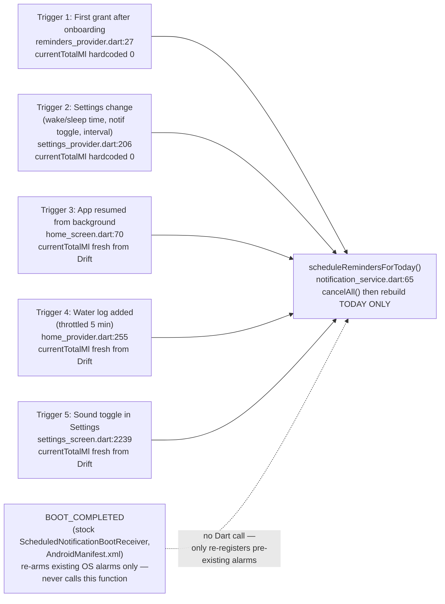

# Notification System Architecture

Read-only audit. No `lib/` or `android/` files were modified to produce this document.

## 1. Cold start sequence

Call order from `main()`:

1. `WidgetsFlutterBinding.ensureInitialized()` — `lib/main.dart:17`
2. `tz.initializeTimeZones()` — `lib/main.dart:20`
3. `FlutterTimezone.getLocalTimezone()` then `tz.setLocalLocation(...)` — `lib/main.dart:21-22`
4. `NotificationService().initialize()` — `lib/main.dart:24`
   - Plugin `initialize()` call is here: `lib/features/reminders/data/notification_service.dart:29`
   - Notification channels are created immediately after, inside the same `initialize()`:
     - `water_reminders` (sound) — `notification_service.dart:33-41`
     - `water_reminders_silent` — `notification_service.dart:42-51`
5. `SharedPreferences.getInstance()` and `prefHasCompletedOnboarding` read — `lib/main.dart:26-28`
6. Stale today-only override cleanup (climate/activity overrides from a previous day) — `lib/main.dart:31-37`
7. `runApp(ProviderScope(...))` — `lib/main.dart:39-47`

**Plugin `initialize()`**: `notification_service.dart:29`
**Channel creation**: `notification_service.dart:33-41` (sound) and `:42-51` (silent) — both run unconditionally on every app start, inside `NotificationService.initialize()`, called once from `main()`.

### What triggers the FIRST-ever scheduling call

Not onboarding completion directly, and not raw "first home screen load" — it is mediated by a provider watch:

1. `OnboardingNotifier.completeOnboarding()` saves the profile and sets `onboardingCompleteProvider` state to `true` — `lib/features/onboarding/presentation/onboarding_provider.dart:155`.
2. The router's `_RouterNotifier` listens to `onboardingCompleteProvider` and calls `notifyListeners()`, which makes `go_router`'s `redirect` callback re-run and send the user to `/home` — `lib/core/routing/app_router.dart:21-27,62-68`.
3. `HomeScreen.build()` unconditionally does `ref.watch(notificationSetupNotifierProvider)` — `lib/features/home/presentation/home_screen.dart:85`. This is what *actually* fires the first scheduling call, because it instantiates `NotificationSetupNotifier`.
4. `NotificationSetupNotifier.build()` — `lib/features/reminders/presentation/reminders_provider.dart:16-42`:
   - Requests OS notification permission (`service.requestPermissions()`, line 19).
   - If granted, reads the just-saved profile via `userProfileProvider.future` (line 22).
   - Reads `soundEnabled` from `SharedPreferences` (lines 24-26).
   - Calls `service.scheduleRemindersForToday(...)` (lines 27-37) — **this is the first-ever scheduling call.**

Because `HomeScreen` is also the `initialLocation: '/home'` route and `notificationSetupNotifierProvider` is watched unconditionally in `build()` (line 85), this same provider is re-entered (cached, not re-run, since Riverpod providers are not auto-recreated on rebuild) every time `HomeScreen` rebuilds, but the actual async `build()` body for the notifier only executes once per app session (or until invalidated), so in practice the "first scheduling call" happens exactly once per cold start, gated on permission grant.

### Values passed on this first call

From `reminders_provider.dart:27-37`:

| Param | Source |
|---|---|
| `wakeHour` / `wakeMinute` | `profile.wakeHour` / `profile.wakeMinute` — freshly-saved `UserProfileModel` from `userProfileProvider.future`, which reads Drift via `HomeRepository.getProfile()` (`home_provider.dart:28-29`, `home_repository.dart:29-32`) |
| `sleepHour` / `sleepMinute` | `profile.sleepHour` / `profile.sleepMinute` — same source |
| `intervalMinutes` | `profile.reminderIntervalMinutes` — same source |
| `currentTotalMl` | **Hardcoded `0`** — `reminders_provider.dart:33`. Not queried from Drift; correct only because this is the user's very first session before any water log exists. |
| `goalMl` | `profile.dailyGoalMl` — same source |
| `notificationsEnabled` | `profile.notificationsEnabled` — same source |
| `soundEnabled` | `SharedPreferences` key `notification_sound` (`AppConstants.prefNotificationSound`), default `true` — `reminders_provider.dart:25-26` |

## 2. Reschedule triggers (complete numbered list)

All call sites of `scheduleRemindersForToday`, found via `grep -rn "scheduleRemindersForToday" lib/`:

**Trigger 1: First-ever schedule on permission grant after onboarding** — `lib/features/reminders/presentation/reminders_provider.dart:27`
- Event: `NotificationSetupNotifier.build()` runs the first time `notificationSetupNotifierProvider` is watched (on `HomeScreen` build, post-onboarding or any cold start where it hasn't run yet), and only if `requestPermissions()` returns granted.
- Params: `currentTotalMl` is hardcoded `0` (not a Drift query, not cache — a literal). All other params come from the freshly-fetched `UserProfileModel` via `userProfileProvider.future`; `soundEnabled` from `SharedPreferences`.
- Debounce/throttle guard: **none.**

**Trigger 2: Settings changes that affect schedule shape** — `lib/features/settings/presentation/settings_provider.dart:206` (private `_reschedule()`), called from:
- `updateWakeTime()` — `settings_provider.dart:148-158` (after time picker confirm)
- `updateSleepTime()` — `settings_provider.dart:160-170`
- `updateNotificationsEnabled()` — `settings_provider.dart:172-184` (toggle on/off)
- `updateReminderInterval()` — `settings_provider.dart:186-198`
- Params: `wakeHour/wakeMinute/sleepHour/sleepMinute/reminderIntervalMinutes/notificationsEnabled/dailyGoalMl` all come from in-memory Riverpod `state.valueOrNull` (the `SettingsNotifier`'s cached `AsyncData`, already updated optimistically before the repository write — `settings_provider.dart:201-202`). **`currentTotalMl` is hardcoded `0`** — `settings_provider.dart:212`. Not a Drift query.
- Debounce/throttle guard: **none.**

**Trigger 3: App resumed from background (foreground lifecycle event)** — `lib/features/home/presentation/home_screen.dart:70`, inside `_rescheduleNotifications()` (`home_screen.dart:61-81`), called from `didChangeAppLifecycleState()` (`home_screen.dart:46-59`) whenever `state == AppLifecycleState.resumed` — line 47, unconditionally (runs both on a same-day resume and a day-rollover resume).
- Params: `wakeHour/wakeMinute/sleepHour/sleepMinute/reminderIntervalMinutes/notificationsEnabled/dailyGoalMl` from `ref.read(userProfileProvider).valueOrNull` — cached provider state, not re-fetched from Drift at this point (`home_screen.dart:62`). `currentTotalMl` **is** freshly queried: `(await ref.read(todayTotalMlProvider.future)).round()` — `home_screen.dart:68`, which resolves from the reactive Drift stream `watchTodayTotalMl()` (`home_repository.dart:22`). `soundEnabled` from `SharedPreferences` (`home_screen.dart:66-67`).
- Debounce/throttle guard: **none** — every single resume event reschedules, regardless of how recently the app was last resumed.

**Trigger 4: Successful water log (quick-add)** — `lib/features/home/presentation/home_provider.dart:255`, inside `HomeAction.addQuickLog()` (`home_provider.dart:206-268`).
- Params: `currentTotalMl: newTotal.round()` where `newTotal = await ref.read(todayTotalMlProvider.future)` (`home_provider.dart:243,261`) — fresh read from the reactive Drift stream, taken *after* `addLog()` has written the new row (`home_provider.dart:215-218`). `goalMl: summary.goalMl` from `todaySummaryProvider.future`, which itself derives from `userProfileProvider` + override state (`home_provider.dart:177-197`). `wakeHour`/etc. from `profile` = `ref.read(userProfileProvider).valueOrNull` — cached provider state (`home_provider.dart:242`).
- Debounce/throttle guard: **yes, quoted exactly** (`home_provider.dart:246-266`):
  ```dart
  // Reschedule so remaining notifications show updated progress
  // Throttled to once per 5 minutes — prevents cancelAll() on every tap
  if (profile != null) {
    final lastReschedule = prefs.getInt('last_reschedule_ms') ?? 0;
    final nowMs = DateTime.now().millisecondsSinceEpoch;
    const fiveMinutes = 5 * 60 * 1000;
    if (nowMs - lastReschedule > fiveMinutes) {
      await prefs.setInt('last_reschedule_ms', nowMs);
      ...
    }
  }
  ```
  The guard is keyed on a single global `last_reschedule_ms` `SharedPreferences` value, shared across *all* triggers that don't themselves write to that key (only Trigger 4 writes it) — see Open Questions, item 3.

**Trigger 5: Notification sound toggle in Settings** — `lib/features/settings/presentation/settings_screen.dart:2239`, inside the `SwitchListTile.onChanged` callback of `_buildSoundToggleTile()` (`settings_screen.dart:2214-2254`).
- Event: user flips the "Notification sound" switch.
- Params: `currentTotalMl: (await ref.read(todayTotalMlProvider.future)).round()` — fresh Drift-backed read (`settings_screen.dart:2237-2238`). `wakeHour/sleepHour/reminderIntervalMinutes/dailyGoalMl` from `ref.read(settingsNotifierProvider).valueOrNull` — cached provider state (`settings_screen.dart:2233-2234`). `notificationsEnabled: true` is **hardcoded literal `true`** (`settings_screen.dart:2247`), not read from `profile.notificationsEnabled` — guarded only by the early return on line 2235 (`if (profile == null || !profile.notificationsEnabled) return;`), so this is safe today but fragile (see Open Questions). `soundEnabled: val` — the new toggle value, not yet persisted to Drift, only to `SharedPreferences` two lines above (`settings_screen.dart:2229-2230`).
- Debounce/throttle guard: **none.**

## 3. How current intake is read

`currentTotalMl` source at each trigger:

| Trigger | Source | Fresh or cached? |
|---|---|---|
| 1. First schedule (`reminders_provider.dart:33`) | Hardcoded `0` | Neither — literal |
| 2. Settings reschedule (`settings_provider.dart:212`) | Hardcoded `0` | Neither — literal |
| 3. App resume (`home_screen.dart:68`) | `todayTotalMlProvider.future` → `watchTodayTotalMl()` Drift stream | Fresh |
| 4. Quick log (`home_provider.dart:243,261`) | `todayTotalMlProvider.future` → same Drift stream, read after the write | Fresh |
| 5. Sound toggle (`settings_screen.dart:2237-2238`) | `todayTotalMlProvider.future` → same Drift stream | Fresh |

`todayTotalMlProvider` (`home_provider.dart:35-37`) wraps `HomeRepository.watchTodayTotalMl()` (`home_repository.dart:22`), which returns the DAO's reactive Drift `Stream<double>`. Because it's a `@riverpod Stream`, Riverpod keeps its cached `AsyncValue` synced to every DB emission for as long as the provider has a listener; `.future` resolves to that latest cached value rather than issuing a fresh query each time, but the cached value itself is push-updated by Drift on every write — so in practice it cannot go stale while listened to.

**Stale-total code path that exists today:** Triggers 1 and 2 hardcode `0` regardless of actual intake. Trigger 1 is only reachable right after onboarding (so `0` happens to be correct), but Trigger 2 (`_reschedule()` in `settings_provider.dart:206`) fires any time the user changes wake/sleep time, the notifications-enabled toggle, or the reminder interval — **at any point in the day, including after the user has already logged water.** This will display `0 ml of <goal> ml` in the rebuilt notification bodies for the rest of that day until a different trigger (3, 4, or 5) fires and corrects it. See Open Questions, item 1.

### Water log success path (`addQuickLog`, `home_provider.dart:206-268`)

```dart
await ref.read(homeRepositoryProvider).addLog(
      amountMl: amountMl,
      drinkTypeId: drinkType.id,
    );
await NotificationService().updateLastLogTime();
...
final newTotal = await ref.read(todayTotalMlProvider.future);
// Reschedule so remaining notifications show updated progress
// Throttled to once per 5 minutes — prevents cancelAll() on every tap
if (profile != null) {
  final lastReschedule = prefs.getInt('last_reschedule_ms') ?? 0;
  final nowMs = DateTime.now().millisecondsSinceEpoch;
  const fiveMinutes = 5 * 60 * 1000;
  if (nowMs - lastReschedule > fiveMinutes) {
    await prefs.setInt('last_reschedule_ms', nowMs);
    final soundEnabled = prefs.getBool(AppConstants.prefNotificationSound) ?? true;
    await NotificationService().scheduleRemindersForToday(
      ...
      currentTotalMl: newTotal.round(),
      ...
    );
  }
}
```
(`home_provider.dart:215-266`) — DB write happens first, then the Drift stream is read for the fresh total, then rescheduling happens only if 5+ minutes have elapsed since the last reschedule.

### Undo path (`deleteLastLog`, `home_provider.dart:296-312`)

```dart
Future<void> deleteLastLog() async {
  final lastLog = await ref.read(lastLogProvider.future);
  if (lastLog == null) return;

  final currentTotal = await ref.read(todayTotalMlProvider.future);
  final summary = await ref.read(todaySummaryProvider.future);
  final totalAfterUndo = currentTotal - lastLog.amountMl;

  await ref.read(homeRepositoryProvider).deleteLog(lastLog.id);
  ref.invalidate(lastLogProvider);

  if (totalAfterUndo < summary.goalMl) {
    ref.read(goalPreviouslyAchievedProvider.notifier).state = false;
  }
}
```
There is **no call to `NotificationService().scheduleRemindersForToday` anywhere in this function.** See Section 4.

## 4. Undo behaviour

`grep -rn "undo\|Undo" lib/features/home/` finds no separate "undo" identifier — the undo feature is implemented as `HomeAction.deleteLastLog()` at `lib/features/home/presentation/home_provider.dart:296-312` (full code reproduced above).

- **Does undo call the scheduling function the same way a regular log does?** No. `deleteLastLog()` deletes the row from Drift (`home_repository.dart` → DAO) and invalidates `lastLogProvider`, but never calls `NotificationService().scheduleRemindersForToday`. Compare to `addQuickLog()`, which always attempts a reschedule (throttled).
- **Will the next notification body correctly reflect the reduced total after undo?** Not immediately. Already-scheduled notifications keep whatever `currentTotalMl` body text was baked in at the last successful schedule call — undo does not cancel or rebuild them. The body will only catch up to the post-undo total the next time *any* of Triggers 1-5 fires (most likely Trigger 3, app resume, or Trigger 4, the next log, after the 5-minute throttle window in Trigger 4 has elapsed). If the user undoes a log and the app is then backgrounded without another log or resume event, every already-scheduled notification for the rest of the day will show the pre-undo (higher) total.

## 5. Next-day-without-opening-app guarantee

**NO — there is no guarantee.** Proof:

The full `scheduleRemindersForToday` body (`lib/features/reminders/data/notification_service.dart:65-146`) is reproduced in Section 6. Key facts:

- `todayWake` and `todaySleep` are both constructed as `tz.TZDateTime(tz.local, now.year, now.month, now.day, ...)` — `notification_service.dart:98-101` — i.e. **always today's date**, derived from `now = tz.TZDateTime.now(tz.local)` (line 96). There is no branch, loop, or second pass that constructs a `tomorrow` date anywhere in this function.
- The `while (scheduledTime.isBefore(todaySleep))` loop (line 115) only ever walks forward from `todayWake + interval` (line 105-106) until `todaySleep` of the **same calendar day**. It cannot cross into the next day because `todaySleep` is fixed to `now.day`.
- Therefore a single call schedules **only today's remaining slots, never tomorrow's.**
- `goalMl`/`currentTotalMl` in that single call are whatever was passed in by the caller for the current day — there is no "tomorrow's progress value," because no tomorrow notifications are ever built.
- If the user never opens the app after today's last notification fires (and never logs water, which also wouldn't help — `addQuickLog`'s reschedule only rebuilds *today's* remaining slots via the same function), **no trigger in Section 2 will run, so `scheduleRemindersForToday` will not be called again, so no notifications will exist for tomorrow.** The notification queue goes empty until the user opens the app again (Trigger 3) or logs water (Trigger 4) or changes a setting (Triggers 2/5) on some future day — at which point that day's remaining slots (from "now" to that day's sleep time) get scheduled, but only for that day.
- **BOOT_COMPLETED**: The only boot-completed handling is the stock `com.dexterous.flutterlocalnotifications.ScheduledNotificationBootReceiver` declared in `android/app/src/main/AndroidManifest.xml` (receiver block, reproduced in full in the manifest excerpt below). This is the `flutter_local_notifications` plugin's built-in receiver, which **only re-arms exact alarms for notifications that were already scheduled with the OS AlarmManager before reboot** — it does not call any Dart code, does not invoke `scheduleRemindersForToday`, and has zero "today+tomorrow" logic of its own. There is no Dart-side `BOOT_COMPLETED` handler in this codebase, and no custom Kotlin receiver (`MainActivity.kt` was checked and contains no receiver code — it's the default Flutter `MainActivity`). So BOOT_COMPLETED only preserves whatever exact alarms already existed; it does not generate new ones and does not implement "today+tomorrow" because no part of this codebase does.

**Conclusion: if the user does not open the app, change a setting, or log water on a given day, no notifications will be scheduled for the following day. The reminder system silently goes empty after one day of total inactivity.**

## 6. Library and scheduling mode

Full text of `scheduleRemindersForToday` (`lib/features/reminders/data/notification_service.dart:63-146`):

```dart
/// Cancels all pending scheduled reminders then schedules one notification
/// per interval slot from [wakeHour] to [sleepHour] for the rest of today.
Future<void> scheduleRemindersForToday({
  required int wakeHour,
  required int wakeMinute,
  required int sleepHour,
  required int sleepMinute,
  required int intervalMinutes,
  required int currentTotalMl,
  required int goalMl,
  required bool notificationsEnabled,
  required bool soundEnabled,
}) async {
  try {
    if (!notificationsEnabled || intervalMinutes == 0) {
      await _plugin.cancelAll();
      return;
    }

    final androidPlugin = _plugin.resolvePlatformSpecificImplementation<
        AndroidFlutterLocalNotificationsPlugin>();
    final canScheduleExact =
        await androidPlugin?.canScheduleExactNotifications() ?? false;
    final scheduleMode = canScheduleExact
        ? AndroidScheduleMode.exactAllowWhileIdle
        : AndroidScheduleMode.inexact;

    await _plugin.cancelAll();

    final channelId = soundEnabled ? _soundChannelId : _silentChannelId;
    final channelName =
        soundEnabled ? 'Water Reminders' : 'Water Reminders (Silent)';

    final now = tz.TZDateTime.now(tz.local);
    final minScheduleTime = now.add(const Duration(minutes: 2));
    final todayWake = tz.TZDateTime(
        tz.local, now.year, now.month, now.day, wakeHour, wakeMinute);
    final todaySleep = tz.TZDateTime(
        tz.local, now.year, now.month, now.day, sleepHour, sleepMinute);

    // First slot is wake + interval, not wake itself
    int notificationId = 100;
    tz.TZDateTime scheduledTime =
        todayWake.add(Duration(minutes: intervalMinutes));

    final percentage =
        goalMl > 0 ? ((currentTotalMl / goalMl) * 100).round() : 0;
    final remaining = (goalMl - currentTotalMl).clamp(0, goalMl);
    final body = currentTotalMl >= goalMl
        ? 'Goal reached! 🎉 $currentTotalMl ml of $goalMl ml'
        : '$currentTotalMl ml of $goalMl ml ($percentage%) — $remaining ml to go';

    while (scheduledTime.isBefore(todaySleep)) {
      if (scheduledTime.isAfter(minScheduleTime)) {
        await _plugin.zonedSchedule(
          notificationId,
          'Time to hydrate! 💧',
          body,
          scheduledTime,
          NotificationDetails(
            android: AndroidNotificationDetails(
              channelId,
              channelName,
              channelDescription: 'Hydration reminders throughout the day',
              importance:
                  soundEnabled ? Importance.high : Importance.low,
              priority: soundEnabled ? Priority.high : Priority.low,
              playSound: soundEnabled,
              enableVibration: soundEnabled,
              icon: '@mipmap/ic_launcher',
            ),
          ),
          androidScheduleMode: scheduleMode,
          uiLocalNotificationDateInterpretation:
              UILocalNotificationDateInterpretation.absoluteTime,
        );

        notificationId++;
      }

      scheduledTime = scheduledTime.add(Duration(minutes: intervalMinutes));
    }
  } catch (_) {}
}
```

- **Does a single call schedule both today's remaining slots AND tomorrow's full set?** NO — proven in Section 5.
- **What progress value does tomorrow's set use?** N/A — no tomorrow set is ever created by this function.
- **Next-day-without-opening-app guarantee:** NO — see Section 5 for full trace.
- **Does BOOT_COMPLETED include this same today+tomorrow logic, or only today?** Neither, precisely — BOOT_COMPLETED (the stock `ScheduledNotificationBootReceiver`) doesn't run any app logic at all; it only re-registers AlarmManager alarms for notifications the OS already knew about pre-reboot, all of which (per Section 5) are "today only" alarms created by the last `scheduleRemindersForToday` call.

**flutter_local_notifications version**: `^18.0.1` — `pubspec.yaml:43`.
**timezone**: `^0.9.4` — `pubspec.yaml:45`. **flutter_timezone**: `^5.0.0` — `pubspec.yaml:44`.

**AndroidScheduleMode**: Conditional, not unconditional. `canScheduleExact = await androidPlugin?.canScheduleExactNotifications() ?? false` (`notification_service.dart:84-85`), then `scheduleMode = canScheduleExact ? AndroidScheduleMode.exactAllowWhileIdle : AndroidScheduleMode.inexact` (`notification_service.dart:86-88`). It is **not** unconditionally `exactAllowWhileIdle` in the main scheduling path — it falls back to `inexact` if the OS denies the exact-alarm permission. (Note: the three debug-only methods `scheduleTestWithSound`, `scheduleTestSilent`, `scheduleTestTiming` — lines 150-219 — *do* hardcode `AndroidScheduleMode.exactAllowWhileIdle` unconditionally, but these are explicitly marked `// Debug tools — remove before final Play Store release`, line 148, and are not part of the production scheduling path.)

**tz.TZDateTime / tz.local consistency**: Used consistently inside `notification_service.dart` (`now`, `minScheduleTime`, `todayWake`, `todaySleep`, `scheduledTime` are all `tz.TZDateTime` built off `tz.local`). However, plain `DateTime.now()` (not timezone-aware) is mixed in elsewhere in code that *feeds into* the notification system or its companion day-rollover logic — e.g. `main.dart:31` (`final now = DateTime.now();` for the stale-override cleanup), `home_provider.dart:60` and `:170` (`TodayOverrideNotifier`'s day-string calculation), `home_provider.dart:277-278` (review-prompt day tracking), `notification_service.dart:223,230` (`markGoalAchievedToday`/`updateLastLogTime`), and `home_screen.dart:48` (`DateUtils.isSameDay(now, _lastKnownDate)` for day-rollover detection in the lifecycle observer). None of these plain-`DateTime` usages feed directly into `zonedSchedule`'s time argument, so they don't desync alarm firing times, but they do mean "what day is today" is computed two different ways (`tz.local`-based inside the scheduler, plain-`DateTime`-based everywhere else) — a device whose timezone offset is mid-transition (DST, or a user crossing a timezone) could in theory see these two notions of "today" disagree by an hour for a short window. Flagged in Open Questions.

## 7. Dual-channel sound system — exact mechanics

Exact channel creation code (`notification_service.dart:33-51`):

```dart
final android = _plugin.resolvePlatformSpecificImplementation<
    AndroidFlutterLocalNotificationsPlugin>();
await android?.createNotificationChannel(
  const AndroidNotificationChannel(
    _soundChannelId,
    'Water Reminders',
    description: 'Hydration reminders throughout the day',
    importance: Importance.high,
    playSound: true,
  ),
);
await android?.createNotificationChannel(
  const AndroidNotificationChannel(
    _silentChannelId,
    'Water Reminders (Silent)',
    description: 'Silent hydration reminders',
    importance: Importance.low,
    playSound: false,
    enableVibration: false,
  ),
);
```
Both channels (`_soundChannelId = 'water_reminders'`, `_silentChannelId = 'water_reminders_silent'`, lines 16-17) are created unconditionally, every app start, inside `initialize()` — neither channel is ever deleted or recreated afterward.

**Channel selection, exact line**: `final channelId = soundEnabled ? _soundChannelId : _silentChannelId;` — `notification_service.dart:92`. This line executes **exactly once per call to `scheduleRemindersForToday`**, not once per individual notification. `channelId` and `channelName` (line 92-94) are computed once, then reused unchanged inside the `while` loop (line 115-144) for every `zonedSchedule` call in that pass.

- **When the function builds 10 notifications for one day, does it pick ONE channel for ALL 10 based on the current `soundEnabled` value, or could it mix channels within a single pass?** ONE channel for all of them. `channelId` is computed once before the loop (line 92) and is a `final` local reused unchanged inside the loop body (line 124) — there is no code path that re-evaluates `soundEnabled` or `channelId` per-iteration, so mixing within a single pass is impossible.
- **If sound is ON, are ALL of that day's scheduled notifications on the sound channel with none on the silent channel, until the user explicitly toggles sound OFF?** Yes, given the above — every notification created in that call uses `_soundChannelId`. The only way any of that day's notifications end up on the silent channel is via a *subsequent* call to `scheduleRemindersForToday` with `soundEnabled: false`, which (per below) cancels and fully rebuilds.
- **When sound is toggled OFF, what happens to already-scheduled notifications — cancelled and rebuilt, or kept on original channel?** Cancelled and fully rebuilt. `await _plugin.cancelAll();` (line 90) runs unconditionally at the top of every call (after the early-return check at lines 77-80, which is a *second*, separate `cancelAll()` for the "notifications disabled or interval 0" case). Every notification from the previous pass — regardless of which channel it was on — is cancelled, then the loop rebuilds a complete new set of notifications from scratch on whichever channel `soundEnabled` now resolves to. No notification ever survives a reschedule call with a stale channel assignment.

## 8. Enable/disable code paths

**Toggled OFF**: `SettingsNotifier.updateNotificationsEnabled(false)` (`settings_provider.dart:172-184`) → optimistic state update (line 175) → `settingsRepositoryProvider.updateNotificationsEnabled(false)` persists to Drift (line 177-179) → `_reschedule()` (line 180) → `scheduleRemindersForToday(..., notificationsEnabled: false, ...)` (`settings_provider.dart:206-216`, `notificationsEnabled: current.notificationsEnabled` evaluates to `false`) → inside `scheduleRemindersForToday`, the very first check is `if (!notificationsEnabled || intervalMinutes == 0) { await _plugin.cancelAll(); return; }` (`notification_service.dart:77-80`). This calls `cancelAll()` and returns immediately — **nothing past line 80 executes**, so no new notifications can be created in the same call that disables them. Nothing can survive `cancelAll()` because it is a full plugin-level cancellation of all pending scheduled notifications, not a per-channel or per-id operation.

**Toggled back ON**: `updateNotificationsEnabled(true)` → same `_reschedule()` path, but now `notificationsEnabled: true` skips the early-return branch and proceeds to rebuild the full set of today's remaining slots from `current.wakeHour`/`sleepHour`/`reminderIntervalMinutes`/`dailyGoalMl`, with `currentTotalMl` hardcoded to `0` (see Section 3 — this is the same staleness issue: turning notifications back on after having already logged water that day will under-report progress in every notification body until another trigger corrects it).

**Other code paths that can disable notifications besides the explicit toggle**:
- `intervalMinutes == 0` ("Off" interval selection) — `notification_service.dart:77`, same `cancelAll()` branch, reachable via `updateReminderInterval(0)` (`settings_provider.dart:186-198`) or via the picker in `settings_screen.dart` (`_formatInterval` treats `0` as `'Off'`, `settings_screen.dart:2206`).
- `SettingsNotifier.deleteAllData()` (`settings_provider.dart:276-285`) wipes the user profile and all logs and resets `onboardingCompleteProvider` to `false`, but **does not call `cancelAll()` or `scheduleRemindersForToday` at all.** Any notifications already scheduled at the time of deletion are not explicitly cancelled by this path — see Open Questions, item 4.
- OS-level permission revocation (user revokes notification permission in Android system settings) is not actively detected anywhere in this codebase — there is no permission-revoked listener. The app would only notice on the next `requestPermissions()` call (`notification_service.dart:54-61`), which only runs inside `NotificationSetupNotifier.build()` (`reminders_provider.dart:16-42`), itself only re-executed when the provider is invalidated or the app cold-starts. Already-scheduled alarms would simply fail to surface (suppressed by the OS) rather than being cancelled by the app.

## 9. Open questions or fragile spots found

1. **Hardcoded `currentTotalMl: 0` in two reschedule call sites** (`reminders_provider.dart:33`, `settings_provider.dart:212`). Trigger 1 is safe by construction (pre-onboarding, no logs exist yet), but Trigger 2 (`_reschedule()`, used by every settings change: wake time, sleep time, notifications-enabled toggle, reminder interval) can run at any time of day, including after the user has already logged water — every notification body rebuilt by this path will incorrectly show `0 ml of <goal> ml` until a different trigger (resume, log, or sound toggle) corrects it.

2. **No reschedule on undo** (`home_provider.dart:296-312`, Section 4). `deleteLastLog()` never calls `scheduleRemindersForToday`, so already-scheduled notification bodies retain the pre-undo (overstated) total until some other trigger fires.

3. **Shared, single-key throttle (`last_reschedule_ms`) only guards Trigger 4.** The 5-minute throttle in `addQuickLog()` (`home_provider.dart:248-251`) reads/writes a single global `SharedPreferences` key, but no other trigger (1, 2, 3, 5) checks or respects this key before calling `cancelAll()` + rebuilding. A user who logs water, then immediately resumes the app from background (Trigger 3) or flips the sound toggle (Trigger 5), will cause a second full `cancelAll()` + rebuild within the same throttle window — the throttle only prevents *rapid repeated taps on the jumbo/log button* from hammering the scheduler, not cross-trigger thrash.

4. **No next-day scheduling guarantee** (Section 5/6) — the single most significant structural gap: `scheduleRemindersForToday` only ever produces alarms for the current calendar day, no trigger schedules tomorrow in advance, and BOOT_COMPLETED only re-arms pre-existing alarms rather than generating new ones. A user who stops opening the app will silently stop receiving any reminders starting the day after their last app interaction.

5. **`deleteAllData()` doesn't cancel notifications** (`settings_provider.dart:276-285`). After wiping all user data and resetting onboarding, any previously-scheduled notifications for "today" are left untouched by this function — they will still fire (with stale body text referencing a goal/total that no longer has a backing profile) until they naturally expire at end-of-day, or until the user re-onboards and a fresh `scheduleRemindersForToday` call cancels them.

6. **`notificationsEnabled: true` hardcoded literal in the sound-toggle call site** (`settings_screen.dart:2247`), rather than reading `profile.notificationsEnabled`. Currently safe only because of the early-return guard two lines above (`settings_screen.dart:2235`), but the hardcoded literal is a latent trap if that guard is ever refactored or removed.

7. **Two different "what day is it" computations**: the scheduler uses `tz.TZDateTime.now(tz.local)` exclusively (`notification_service.dart`), while day-rollover/override/review-streak logic elsewhere uses plain `DateTime.now()` (`main.dart:31`, `home_provider.dart:60,170,277-278`, `home_screen.dart:48`, `notification_service.dart:223,230`). They don't currently interact in a way that breaks alarm firing times, but they represent two parallel, not-obviously-synchronized notions of "today" in the same codebase.

8. **Debug-only scheduling methods left in production code path** (`notification_service.dart:150-219`: `scheduleTestWithSound`, `scheduleTestSilent`, `scheduleTestTiming`), explicitly flagged in-code as `// Debug tools — remove before final Play Store release` (line 148) but still present, still hardcode `AndroidScheduleMode.exactAllowWhileIdle` unconditionally (unlike the production path's permission-conditional logic), and still reachable wherever they're wired into the UI debug menu.

## Reschedule trigger flowchart


